# 👋 Hello, I'm man-mu! 👨‍💻

## 📊 Visitor Count 

## 🚀 About Me
- 🏫 **CQUPT** | 通信与信息类
- 💻 **专注领域**: 后端开发 (Backend Development)
- 🌐 **我的博客**: <a href="http://blog-manmu.top/" target="_blank">空中花园</a>
- 📝 **CSDN主页**: <a href="https://blog.csdn.net/2503_93079769?spm=1000.2115.3001.5343" target="_blank">漫霂 - CSDN博客</a>

## 🛠️ Tech Stack

### Programming Languages

### Frameworks & Libraries

### Databases, Middleware & DevOps

  <!-- 换行让排版更美观 -->

  <!-- 换行让排版更美观 -->

## 📈 GitHub Stats

 

## 🔥 GitHub Streak

